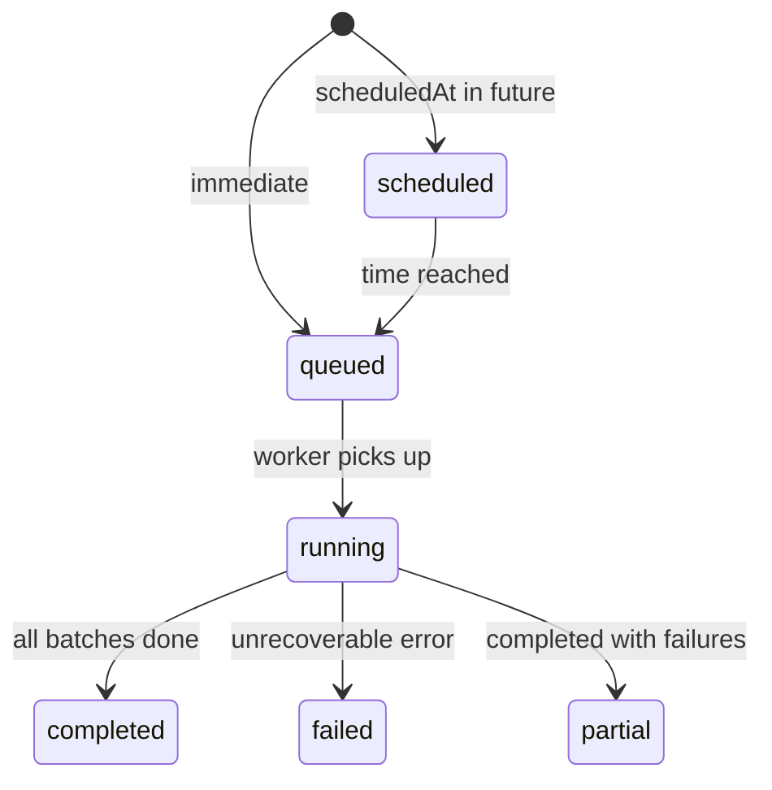

# API Specification

## Base URL

```
http://localhost:3000/api/v1
```

---

## Endpoints (Required by Assignment)

### 1. List Bulk Actions

```
GET /bulk-actions
```

**Query Params (our additions for UI):**
| Param | Type | Description |
|-------|------|-------------|
| `accountId` | string | Filter by account |
| `status` | string | `queued`, `running`, `completed`, `failed`, `scheduled` |
| `page` | number | Pagination (default 1) |
| `limit` | number | Page size (default 20) |

**Response 200:**
```json
{
  "data": [
    {
      "id": "674a1b2c3d4e5f6789012345",
      "accountId": "acc_123",
      "entityType": "contact",
      "actionType": "bulk_update",
      "status": "running",
      "totalCount": 5000,
      "processedCount": 2500,
      "successCount": 2450,
      "failureCount": 30,
      "skippedCount": 20,
      "progressPercent": 50,
      "scheduledAt": null,
      "createdAt": "2026-07-11T04:30:00.000Z",
      "startedAt": "2026-07-11T04:30:05.000Z",
      "completedAt": null
    }
  ],
  "pagination": {
    "page": 1,
    "limit": 20,
    "total": 42
  }
}
```

---

### 2. Create Bulk Action

```
POST /bulk-actions
```

**Request Body — Bulk Update (Contact):**
```json
{
  "accountId": "acc_123",
  "entityType": "contact",
  "actionType": "bulk_update",
  "filters": {
    "status": "inactive"
  },
  "updates": {
    "status": "active",
    "name": "Updated Name"
  },
  "entityIds": ["id1", "id2", "id3"],
  "scheduledAt": "2026-11-22T17:45:00.000Z"
}
```

**Notes:**
- Provide either `filters` (update all matching) OR `entityIds` (update specific records)
- `scheduledAt` is optional — if present, job is delayed until that time
- `accountId` required for rate limiting

**Response 202 Accepted:**
```json
{
  "id": "674a1b2c3d4e5f6789012345",
  "status": "queued",
  "message": "Bulk action queued successfully",
  "totalCount": 5000
}
```

**Response 429 (Rate Limited):**
```json
{
  "error": "Rate limit exceeded",
  "limit": 10000,
  "window": "1 minute",
  "retryAfter": 45
}
```

---

### 3. Get Bulk Action Status

```
GET /bulk-actions/:actionId
```

**Response 200:**
```json
{
  "id": "674a1b2c3d4e5f6789012345",
  "accountId": "acc_123",
  "entityType": "contact",
  "actionType": "bulk_update",
  "status": "running",
  "payload": {
    "updates": { "status": "active" },
    "filters": { "status": "inactive" }
  },
  "totalCount": 5000,
  "processedCount": 2500,
  "successCount": 2450,
  "failureCount": 30,
  "skippedCount": 20,
  "progressPercent": 50,
  "error": null,
  "scheduledAt": null,
  "createdAt": "2026-07-11T04:30:00.000Z",
  "startedAt": "2026-07-11T04:30:05.000Z",
  "completedAt": null
}
```

---

### 4. Get Bulk Action Statistics

```
GET /bulk-actions/:actionId/stats
```

**Response 200:**
```json
{
  "actionId": "674a1b2c3d4e5f6789012345",
  "status": "completed",
  "totalCount": 5000,
  "successCount": 4900,
  "failureCount": 50,
  "skippedCount": 50,
  "progressPercent": 100,
  "durationMs": 45000,
  "throughputPerMinute": 6666
}
```

---

## Additional Endpoints (For UI + Completeness)

### 5. Get Bulk Action Logs

```
GET /bulk-actions/:actionId/logs
```

**Query Params:**
| Param | Type | Description |
|-------|------|-------------|
| `status` | string | Filter: `success`, `failed`, `skipped` |
| `page` | number | Pagination |
| `limit` | number | Page size (default 50) |

**Response 200:**
```json
{
  "data": [
    {
      "entityId": "contact_001",
      "entityType": "contact",
      "status": "success",
      "message": "Updated fields: status",
      "error": null,
      "processedAt": "2026-07-11T04:30:10.000Z"
    },
    {
      "entityId": "contact_002",
      "entityType": "contact",
      "status": "skipped",
      "message": "Duplicate email: john@example.com",
      "error": null,
      "processedAt": "2026-07-11T04:30:10.000Z"
    },
    {
      "entityId": "contact_003",
      "entityType": "contact",
      "status": "failed",
      "message": null,
      "error": "Validation failed: invalid email format",
      "processedAt": "2026-07-11T04:30:10.000Z"
    }
  ],
  "pagination": { "page": 1, "limit": 50, "total": 5000 }
}
```

---

### 6. Contacts CRUD (Supporting Endpoints)

```
GET    /contacts              — List contacts (for UI table)
GET    /contacts/:id          — Single contact
POST   /contacts              — Create contact (seed/testing)
POST   /contacts/seed         — Bulk seed from count param
```

---

## Status Lifecycle



---

## Related Notes

- [[04-Data-Models]]
- [[00-Assignment-Overview]]
