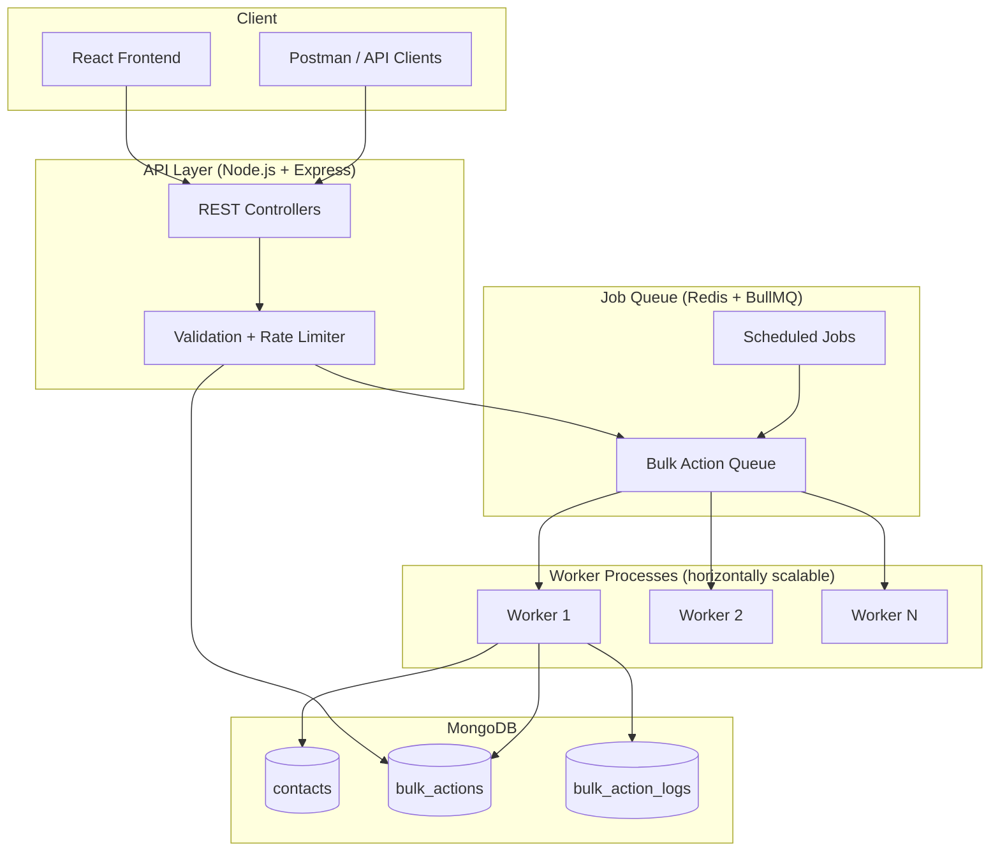

# Architecture Plan

## High-Level Architecture



---

## Design Principles

### 1. Entity-Agnostic Action Framework

Use a **Strategy Pattern** so each bulk action type is a pluggable handler:

```
BulkActionHandler (interface)
├── BulkUpdateHandler   ← implement first
├── BulkDeleteHandler   ← future
└── BulkAssignHandler   ← future
```

Each handler defines:
- `entityType` (e.g., `contact`)
- `validatePayload(payload)` 
- `processBatch(entities, payload)` → `{ success, failed, skipped }`

The **orchestrator** (worker) doesn't know business logic — it only:
1. Fetches batch of entity IDs
2. Calls the right handler
3. Writes logs
4. Updates progress counters

### 2. Async Processing Flow

```
POST /bulk-actions
  → Validate request + rate limit check
  → Create bulk_action document (status: queued)
  → Enqueue job in BullMQ
  → Return 202 { actionId, status: "queued" }

Worker picks up job
  → status: running
  → Loop batches (e.g., 500 IDs per batch):
      → Fetch contacts from MongoDB
      → Run dedup check (optional)
      → Apply updates via handler
      → Bulk insert logs
      → Update progress (processedCount, successCount, etc.)
  → status: completed | failed | partial
```

### 3. Batch Processing Strategy

| Parameter | Recommended Value | Why |
|-----------|-------------------|-----|
| Batch size | 500 records | Balance between memory and DB round-trips |
| Concurrency | 2–5 workers per instance | Avoid MongoDB write contention |
| Bulk writes | `bulkWrite()` for updates | Much faster than individual updates |
| Log writes | Insert many at once | Reduce I/O |

For **thousands/minute** target:
- 500 records/batch × 4 batches/sec = **2,000 records/sec** theoretical
- With 2 worker instances → easily hits **thousands/minute**

### 4. Horizontal Scaling

| Component | Scale Strategy |
|-----------|----------------|
| API servers | Stateless → run multiple Node instances behind load balancer |
| Workers | Add more worker processes/containers independently |
| Redis | Single instance fine for assignment; Redis Cluster for prod |
| MongoDB | Replica set; shard by `accountId` at scale |

### 5. Progress Tracking

Store on `bulk_actions` document:

```json
{
  "status": "running",
  "totalCount": 5000,
  "processedCount": 2500,
  "successCount": 2400,
  "failureCount": 50,
  "skippedCount": 50,
  "progressPercent": 50,
  "startedAt": "...",
  "completedAt": null
}
```

Frontend polls `GET /bulk-actions/:id` every 2–3 seconds for live progress.

---

## Modular Bulk Action Registration

```typescript
// registry.ts — adding a new action = one file + one registry entry
const actionRegistry = {
  'contact:bulk_update': BulkUpdateHandler,
  'contact:bulk_delete': BulkDeleteHandler,  // future
};
```

To add a new bulk action later:
1. Create handler class implementing `BulkActionHandler`
2. Register in `actionRegistry`
3. Add validation schema for payload
4. **No changes to worker orchestrator**

---

## Error Handling Strategy

| Level | Behavior |
|-------|----------|
| Single entity failure | Log error, increment `failureCount`, continue batch |
| Batch failure | Retry batch up to 3 times with exponential backoff |
| Job failure | Mark action `failed`, store error message |
| Invalid payload | Reject at API layer with 400 |

Each log entry:

```json
{
  "actionId": "...",
  "entityId": "...",
  "entityType": "contact",
  "status": "success | failed | skipped",
  "message": "Updated status to active",
  "error": null,
  "processedAt": "..."
}
```

---

## Optional Features Architecture

### Rate Limiting
- Redis sliding window counter keyed by `accountId`
- Check before enqueueing: `INCR account:{id}:bulk_events` with TTL 60s
- Reject with `429 Too Many Requests` if > 10,000/min

### De-duplication
- Within a bulk action payload, track seen emails in a Set
- Also optionally check against DB for existing duplicates in batch
- Mark duplicates as `skipped` in logs

### Scheduling
- BullMQ supports `delay` option on job creation
- Store `scheduledAt` on bulk_action document
- Status: `scheduled` → auto-transition to `queued` when job fires

---

## Folder Structure (Monorepo)

```
shipments/
├── shipments-vault/         ← Obsidian vault
├── packages/
│   ├── api/                 ← Express REST API
│   │   ├── src/
│   │   │   ├── controllers/
│   │   │   ├── routes/
│   │   │   ├── middleware/
│   │   │   └── validators/
│   │   └── package.json
│   ├── worker/              ← BullMQ worker process
│   │   └── src/
│   │       ├── handlers/
│   │       ├── orchestrator.ts
│   │       └── index.ts
│   └── shared/              ← Types, schemas, constants
│       └── src/
├── apps/
│   └── web/                 ← React frontend
├── postman/
│   └── bulk-actions.postman_collection.json
├── scripts/
│   ├── seed-contacts.ts
│   └── generate-csv.ts
├── docker-compose.yml       ← MongoDB + Redis
└── README.md
```

---

## Related Notes

- [[00-Assignment-Overview]]
- [[02-Tech-Stack]]
- [[03-API-Specification]]
- [[04-Data-Models]]
